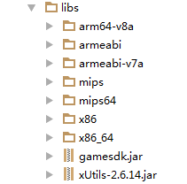
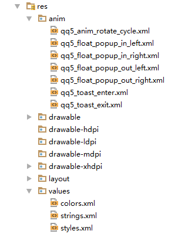

QQ5手游SDK(单机版)

Android接入文档


版本|作者|内容|时间
:---:|:---:|:---:|:---:
1.0.0	|Feng Jibo <br>Zhu Dongya|初始版本|2017/6/28

# 目录

[1.准备工作](#prepare)

[2.配置和导入SDK](#input)

[3.SDK接口说明](#main)
1. [初始化](#init)
2. [支付](#pay)
3. [游戏内返回键处理](#backPress)

[4.内容补充](#moreInfo)


<h1 id="input">1.准备工作</h1>

1.联系官方人员获取AppId，AppKey。

  **AppId:产品ID**

  **AppKey:SDK通信key**

2.下载官方提供的SDK以及demo。

<h1 id="main">2.配置和导入SDK</h1>

**1.手动导入**

A.若是eclipse用户，工程里 project.properties 文件中 manifestmerger.enabled 设置为
  false, 或默认不加该配置。

B.将 sdk 工程中 Androidmanifest 中 require 标记内容拷贝到
  游戏工程 Androidmanifest中：
```xml
    <!-- QQ5sdk required -->
    <!-- 请求网络 -->
    <uses-permission android:name="android.permission.INTERNET" />
    <!-- 获取设备信息 -->
    <uses-permission android:name="android.permission.READ_PHONE_STATE" />
    <!-- SD读写文件 -->
    <uses-permission android:name="android.permission.WRITE_EXTERNAL_STORAGE" />
    <uses-permission android:name="android.permission.READ_EXTERNAL_STORAGE" />
    <!-- 读取网络状态 -->
    <uses-permission android:name="android.permission.ACCESS_NETWORK_STATE" />
    <uses-permission android:name="android.permission.ACCESS_WIFI_STATE" />
    <uses-permission android:name="android.permission.GET_TASKS" />
    <!-- QQ5sdk required -->

    <!-- QQ5sdk required -->
        <meta-data
            android:name="QQ5_CHANNEL"
            android:value="your channel" />

        <activity
            android:name="com.qq5sdk.standalone.ui.web.SdkWebActivity"
            android:configChanges="keyboardHidden|orientation|screenSize"
            android:hardwareAccelerated="true"
            android:screenOrientation="portrait"
            android:theme="@android:style/Theme.NoTitleBar"
            android:windowSoftInputMode="adjustResize" />

        <activity
            android:name="com.heepay.plugin.activity.WeChatNotityActivity"
            android:configChanges="orientation|keyboardHidden|screenSize"
            android:screenOrientation="behind"
            android:theme="@android:style/Theme.Translucent.NoTitleBar" />

        <activity
            android:name="com.alipay.sdk.app.H5PayActivity"
            android:configChanges="orientation|keyboardHidden|navigation|screenSize"
            android:exported="false"
            android:screenOrientation="behind"
            android:windowSoftInputMode="adjustResize|stateHidden" />

        <activity
            android:name="com.alipay.sdk.auth.AuthActivity"
            android:configChanges="orientation|keyboardHidden|navigation"
            android:exported="false"
            android:screenOrientation="behind" />

        <activity
            android:name="com.ipaynow.plugin.presenter.PayMethodActivity"
            android:configChanges="keyboardHidden|navigation|orientation|screenSize"
            android:exported="false"
            android:screenOrientation="portrait"
            android:theme="@android:style/Theme.Dialog" />

        <activity
            android:name="com.ipaynow.plugin.inner_plugin.wechatwp.activity.WeChatNotifyActivity"
            android:configChanges="keyboardHidden|navigation|orientation|screenSize"
            android:exported="false"
            android:launchMode="singleTop"
            android:screenOrientation="behind"
            android:theme="@android:style/Theme.Dialog" />

        <activity
            android:name="com.qq5sdk.standalone.ui.PayActivity"
            android:configChanges="keyboardHidden|orientation|screenSize"
            android:theme="@android:style/Theme.Translucent.NoTitleBar"
            android:launchMode="singleTask"
            android:windowSoftInputMode="adjustPan|stateAlwaysHidden|adjustResize" />
        <!-- QQ5sdk required -->

```


C.Lib目录下文件根据游戏工程所支持进行选择性拷贝
  如：游戏工程lib只有armeabi文件夹，则保留同名文件夹，删除其余文件夹。如果游戏工程没有任何同名文件夹，则默认使用armeabi文件夹。如图:



D.拷贝res目录下所有文件夹到游戏工程里面，注意命名是否重复，防止覆盖。res里面的文件请勿修改或删除，从而影响功能的使用。



<h1 id="moreInfo">3.SDK接口说明</h1>

<h2 id="init">1.初始化</h2>

初始化方法 init() 定义在 QQ5SDK.java 中，请在 QQ5SDK.getInstance() 后即可调用。

此方法具有两个重载方法，请根据需求自行选择。

**在启动游戏时调用，必须先调用初始化接口才能调用其他接口。**

调用示例：
```java
    /**
     * 初始化接口, 默认开启qq5闪屏
     *
     * @param activity   当前游戏的Activity
     * @param orientation    横屏 HORIZONTAL 竖屏 VERTICAL
     * @param appId    在QQ5游戏中心申请的appid
     * @param appKey   在QQ5游戏中心申请的appkey
     * @param splashDismissCallBack  初始化完毕回调接口
     */
     QQ5Sdk.getInstance().init(activity, orientation, appId, appKey, new SplashDismissCallBack() {
         @Override
         public void onDismiss() {
              //方法将在初始化完毕时调用
         }
     });


     /**
      * 初始化接口
      *
      * @param activity   当前游戏的Activity
      * @param orientation    横屏 HORIZONTAL 竖屏 VERTICAL
      * @param appId    在QQ5游戏中心申请的appid
      * @param appKey   在QQ5游戏中心申请的appkey
      * @param splashVisibility 是否启动闪屏 true or false
      * @param splashDismissCallBack  初始化完毕回调接口
      */
      QQ5Sdk.getInstance().init(activity, orientation, appId, appKey, false, new SplashDismissCallBack() {
          @Override
          public void onDismiss() {
               //方法将在初始化完毕时调用
          }
      });

```

参数表：

参数名称|类型|备注|是否必填
:---:|:---:|:---:|:---:
activity|android.app.Activity|当前游戏的Activity|是
orientation|int|请填写 QQ5Sdk.HORIZONTAL 或 QQ5Sdk.VERTICAL|是
appId|String|在QQ5游戏中心申请的appid|是
appKey|String|在QQ5游戏中心申请的appkey|是
splashVisibility|boolean|是否开启闪屏|是
splashDismissCallBack|com.qq5sdk.api.SplashDismissCallBack|初始化完毕回调接口|是

<h2 id="pay">2.支付及其结果回调</h2>

支付方法 pay() 定义在 QQ5SDK.java 中，请在 QQ5SDK.getInstance() 后即可调用。
进入游戏后才能调用该接口。

调用示例：

```java
    /**
     * 支付接口 (必接)
     * 拉起支付界面，注册支付回调监听器。
     *
     * @param activity 当前游戏的Activity
     * @param gameOrderId 游戏订单id
     * @param gameCoin 游戏币数量(1)
     * @param gameCoinName 游戏币名称（元宝）
     * @param amount 充值金额须大于0.1，支持一位小数（单位：元）
     * @param extra 透传字段（SDK服务端回调原样返回）
     * @param payCallBack 支付回调接口
     */
    QQ5Sdk.getInstance().onPay(activity, gameOrderId, gameCoin, gameCoinName, amount, extra, new PayCallBack() {

        @Override
        public void success(String message) {
              //支付成功
              //success --> 支付成功
        }

        @Override
        public void failed(String message) {
            //失败，请查看错误详情
            //process --> 支付中
            //fail --> 支付失败
        }

        @Override
        public void cancel() {
          //支付取消，关闭支付弹框时的回调
        }

    });
```

参数表：

参数名称|类型|备注|是否必填
:---:|:---:|:---:|:---:
activity|android.app.Activity|当前游戏的Activity|是
gameOrderId|java.lang.String| 游戏订单id|是
gameCoin|java.lang.String|游戏币数量|是, 可为空字符串，不能为null
gameCoinName|java.lang.String|游戏币名称（元宝）|是
amount|java.lang.String|充值金额须大于0.1，支持一位小数（单位：元）|是
extra|java.lang.String|透传字段（SDK服务端回调原样返回）|否
payCallBack|com.qq5sdk.api.PayCallBack|支付回调接口|是

同时请在游戏支付的 Activity（即为 onPay方法的第一个参数 ）中，请复写该 Activity 的 onActivityResult 方法中调用 QQ5Sdk 的 handlerActivityResult方法，如果不添加的话，将无法收到支付结果的回调。

调用示例：

```java
    @Override
    protected void onActivityResult(int requestCode, int resultCode, Intent data) {
        super.onActivityResult(requestCode, resultCode, data);
        QQ5Sdk.getInstance().handlerActivityResult(requestCode, resultCode, data);
    }
```

支付结果错误码:

属性值|含义|建议操作
:---:|:---:|:---:
success|PayResponse.SUCCESS（成功）|提示用户支付操作成功
fail|PayResponse.FAILURE（失败）|提示用户支付失败
process|PayResponse.PROCESS（用户中途取消支付）|用户主动取消了支付

**cancel()指的是用户对支付弹框的关闭回调，取消支付。**

<h2 id="backPress">3.游戏内返回键处理</h2>

此方法可以在游戏内按下返回键触发，可以弹出退出提示等业务逻辑。

建议在 Activity#onBackPressed 方法或者 onKeyDown 方法中调用。

方法 handleBackAction() 定义在 QQ5SDK.java 中，请在 QQ5SDK.getInstance() 后即可调用。

调用示例：

```java
      /**
      * 游戏界面返回键处理（退出事件）
      * 打开退出应用提示
      *
      * @param activity 当前游戏的Activity
      * @param exitCallBack 返回事件回调
      */
      QQ5Sdk.getInstance().handleBackAction(activity, new ExitCallBack() {
          @Override
          public void exit() {
              //此回调将在点击“退出游戏”按钮时触发
          }
      });
```


参数表：

参数名称|类型|备注|是否必填
:---:|:---:|:---:|:---:
activity|android.app.Activity|当前游戏的Activity|是
exitCallBack|com.qq5sdk.api.ExitCallBack|返回事件回调|是

<h2 id="orientationChange">4.横竖屏切换回调接入接口(若游戏不支持横竖屏切换可不接)</h2>

方法 orientationChange() 定义在 QQ5SDK.java 中，请在 QQ5SDK.getInstance() 后即可调用。

调用示例：
```java
    @Override
    public void onConfigurationChanged(Configuration newConfig) {
        super.onConfigurationChanged(newConfig);
        QQ5Sdk.getInstance().orientationChange(this);
    }
```

参数表：

参数名称|类型|备注|是否必填
:---:|:---:|:---:|:---:
activity|android.app.Activity|当前游戏的Activity|是

<h2 id="getAppId">5.获取AppId</h2>

方法 getAppId() 定义在 QQ5SDK.java 中，请在 QQ5SDK.getInstance() 后即可调用。

<h2 id="getAppKey">6.获取AppKey</h2>

方法 getAppKey() 定义在 QQ5SDK.java 中，请在 QQ5SDK.getInstance() 后即可调用。

<h1 id="moreInfo">4.补充内容</h1>

**调试时请优先设置QQ5Sdk.getInstance().setDebugEnabled(true)， 方便查看log。**

**具体使用场景，调用方式，请参考demo，必要时可联系官方技术人员。**
